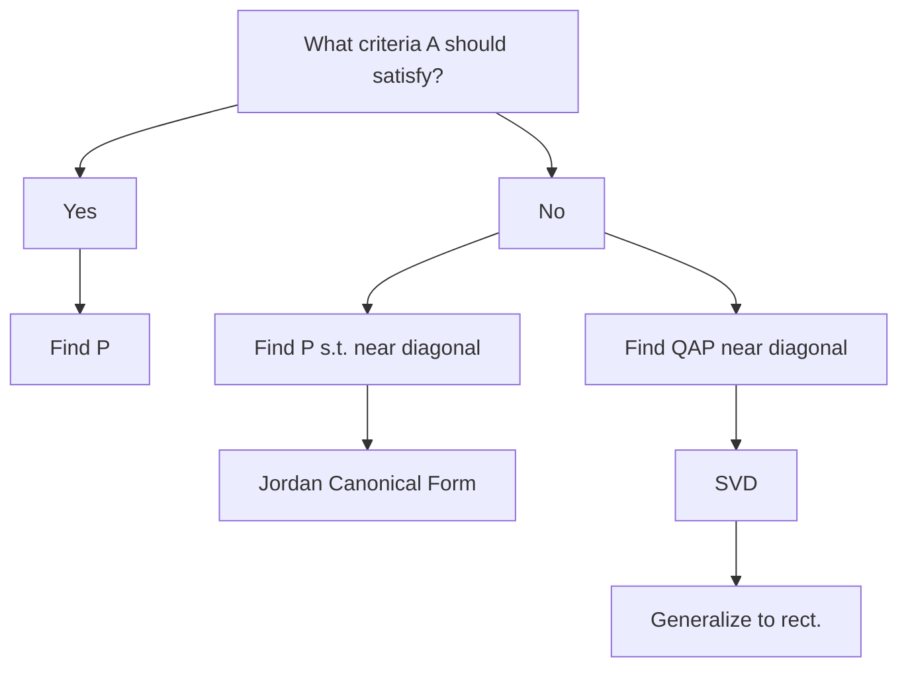

# Eigenvalues and Diagonalization

## Central Question
When can we write $A = PDP^{-1}$ with $D$ diagonal?

## 1. Diagonalizability Criteria

### Sufficient Conditions (Multiple Perspectives)
$A$ is diagonalizable if ANY of these hold:
- (Axler) Minimal polynomial has distinct roots
- (Strang) $n$ linearly independent eigenvectors
- All geometric multiplicities = algebraic multiplicities

### Algorithm
1. Find eigenvalues: $\det(A - \lambda I) = 0$
2. For each $\lambda$, find eigenvectors: $(A - \lambda I)v = 0$
3. If you get $n$ independent eigenvectors → diagonalizable
4. Form $P = [v_1 | v_2 | ... | v_n]$

## 2. Special Cases

### Always Diagonalizable
- Symmetric matrices ($A = A^T$) → [[Spectral Theorem]]
- Matrices with $n$ distinct eigenvalues

### When Not Diagonalizable
- **Jordan Form**: Generalization for all matrices
- **For rectangular**: See [[svd]] 

