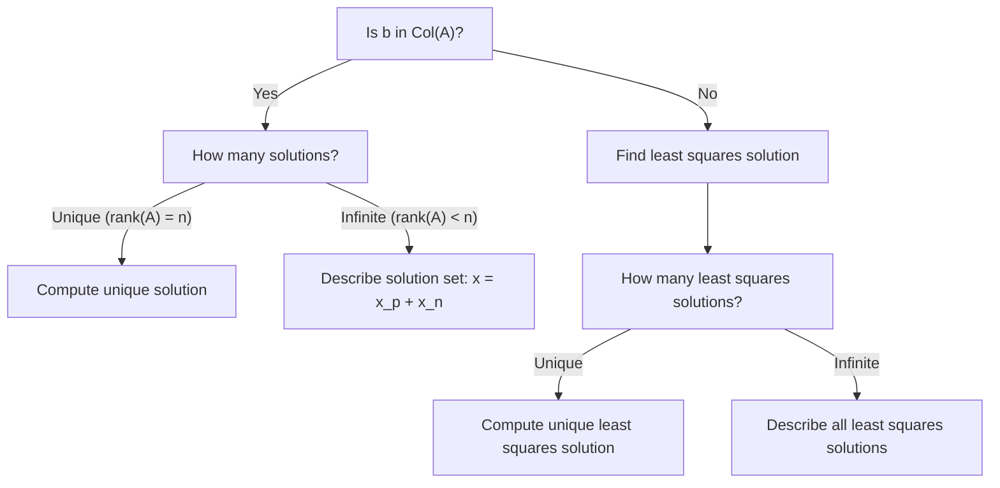

# Solving Ax = b

## Decision Process

Does a solution exist? A solution exists if and only if $b$ is in the column space of $A$:

$Ax = b \text{ has a solution} \iff b \in \text{Col}(A) \iff \text{rank}[A|b] = \text{rank}(A)$

## Solution Classification

If a solution exists:

- Unique Solution:
    
    - $\text{rank}(A) = n$ (full column rank)
    - For square $A$: $A$ is invertible, so $x = A^{-1}b$
    - The nullspace of $A$ contains only the zero vector
- Infinitely Many Solutions:
    
    - $\text{rank}(A) < n$ (columns are linearly dependent, free variables exist)
    - All solutions: $x = x_p + x_n$
        - $x_p$: any particular solution
        - $x_n$: any vector in the nullspace of $A$

If no solution exists: Find the closest solution in the least-squares sense (minimize $|Ax - b|^2$).

## Quick Decision Tree

## Computational Methods

|System Type|Method|Notes|
|---|---|---|
|Square|Gaussian elimination, LU|For unique solutions|
|Overdetermined|QR factorization|For least-squares/minimum residual|
|Underdetermined|Row reduction to RREF|Find parametric solution set|
|No exact solution|Normal equations, Pseudoinverse|For least-squares/minimum norm solution|

## Least Squares Solutions

- The least-squares solution is where $Ax$ is the orthogonal projection of $b$ onto the column space of $A$.
- If $Ax = b$ is consistent, the least-squares solution equals the exact solution.
- Otherwise, solve:
    - Normal equations: $A^T A x = A^T b$
    - Pseudoinverse: $x = A^\dagger b$

In summary:

- First: Check if $b$ is in the column space of $A$.
- If yes: Determine if the solution is unique or infinite.
- If no: Find the least-squares solution using normal equations or the pseudoinverse.

This structure mirrors the logic of a decision tree: start with existence, then classify the solution set, and finally select the computational method accordingly.