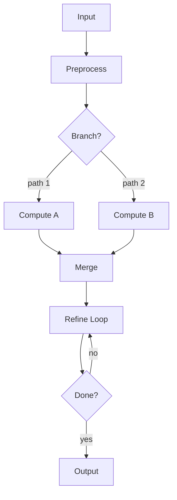

# Algorithm Name

## 0. Summary

Goal: One sentence describing what this algorithm achieves.

When to use: Conditions where this is the right tool.

When not to use: Known failure regimes.

---

## 1. Problem

### What are we solving?

- Input: What you have (type, shape, units)
- Output: What you want (type, shape, units)
- Success: How you know it worked

### Assumptions

- A1: ...
- A2: ...

---

## 2. Interface

### Inputs

| Symbol | Description | Type | Shape |
|--------|-------------|------|-------|
| $X$ | ... | ... | ... |

### Outputs

| Symbol | Description |
|--------|-------------|
| $\theta$ | ... |

### Tunable Parameters

| Symbol | Description | Default |
|--------|-------------|---------|
| $\lambda$ | regularization | ... |
| $N$ | max iterations | ... |

---

## 3. Math

### Forward Model

How parameters map to predictions:

$$
\hat{z} = h(x, \theta)
$$

### Objective

What you optimize:

$$
\theta^* = \arg\min_\theta \; \mathcal{L}(\theta)
$$

### Constraints

| Type | Expression |
|------|------------|
| Equality | $c(\theta) = 0$ |
| Inequality | $g(\theta) \le 0$ |
| Manifold | $\theta \in SO(3)$ |

---

## 4. Workflow

### Graph Type

- [ ] DAG (no loops)
- [ ] Iterative (has loops)
- [ ] Dynamic (graph changes at runtime)

### Diagram



### Control Flow Patterns Used

Branches:
- [ ] Exclusive (if/else)
- [ ] Parallel (fork)
- [ ] Fallback (try A, else B)

Joins:
- [ ] Barrier (wait all)
- [ ] Reduce (sum/mean/max)
- [ ] Select (pick best)

Parallelism:
- [ ] Fork-join
- [ ] Data-parallel (parfor)
- [ ] Pipeline

### Loops

For each loop, specify:

```
Loop: <name>
Type: for | while | until
Carries: <state variables>
Init: <starting values>
Update: <iteration rule>
Stop: <termination condition>
Invariant: <what stays true>
On failure: <fallback>
```

---

## 5. Algorithm

### Pseudocode

```
Inputs:  ...
Outputs: ...

1: validate()
2: initialize S₀

3: parfor i in 1..N:
       local[i] ← compute(i)

4: global ← reduce(local)

5: k ← 0
   repeat:
       k ← k + 1
       S ← update(S, global)
   until converged(S) or k = k_max

6: return S
```

### Step Details

For each non-trivial step:

Step <i>: <name>

Purpose: Why this step exists.

Equation:
$$
...
$$

Method: Closed-form / iterative / solver name.

Complexity: Time $O(...)$, Memory $O(...)$.

Check: How to verify this step is correct.

---

## 6. Stopping Criteria

| Criterion | Threshold |
|-----------|-----------|
| Loss change | < eps |
| Gradient norm | < eps |
| Max iterations | K |

Expected: Monotonic decrease / oscillatory.

Failure sign: Loss increases, NaNs appear, no progress.

---

## 7. Implementation

Data: Batching, precision (float32/64), caching.

Robustness: Outlier handling, missing data, NaN protection.

Reproducibility: Seeds, versions, deterministic mode.

---

## 8. Verification

### Tests

- [ ] Synthetic case with known answer
- [ ] Dimension/shape checks
- [ ] Invariant checks

### Metrics

| Metric | Purpose |
|--------|---------|
| RMSE | Accuracy |
| Runtime | Speed |
| Memory | Efficiency |

---

## 9. Troubleshooting

| Symptom | Cause | Fix |
|---------|-------|-----|
| No convergence | Step size too large | Reduce learning rate |
| NaN output | Division by zero | Add epsilon to denominator |
| Slow | Bad conditioning | Normalize inputs |

### Debug Checklist

- [ ] Plot loss curve
- [ ] Print intermediate values
- [ ] Check matrix conditioning
- [ ] Verify input ranges

---

## 10. Extensions

- Alternative solvers for step X
- Generalizations (nonlinear, non-Gaussian, etc.)

---

## 11. References

1. ...
2. ...
